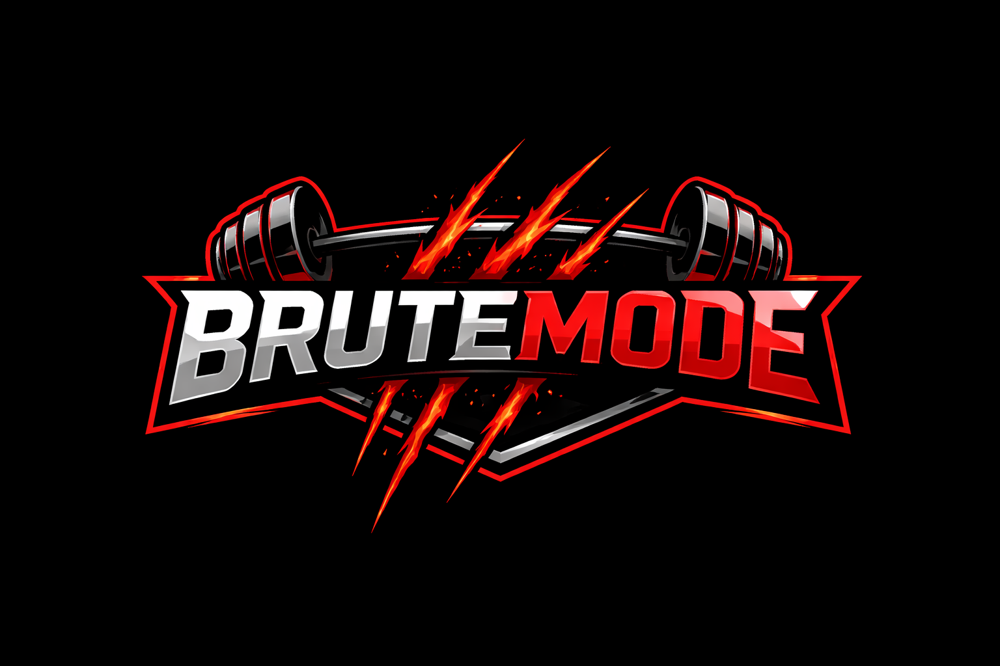

<!-- BruteMode Logo -->
<p align="center">
  
</p>

<h1 align="center">BruteMode</h1>

<p align="center">
  A comprehensive fitness tracking web application to help you achieve your workout goals.
</p>

---

## 📋 Description

BruteMode is a powerful, all-in-one fitness tracking system designed for athletes and fitness enthusiasts. It allows users to track workouts, manage exercises, log body measurements, monitor daily habits, earn points, unlock achievements, and visualize progress through interactive charts.

---

## ✨ Features

### 🏋️ Workout Management
- Create, edit, and delete workouts
- Add exercises to workouts with sets, reps, and weight tracking
- Automatic 1RM (One Rep Max) calculation
- Total volume tracking per workout
- Duplicate previous workouts for quick logging

### 📚 Exercise Library
- Pre-seeded exercise library (23 exercises)
- Add custom exercises with muscle group categorization
- Mark exercises as favorites
- Search and filter exercises by name or muscle group

### 📏 Body Tracking
- Log body measurements (weight, neck, chest, waist, hips, arm, thigh)
- Upload progress photos
- Interactive weight chart showing progress over time

### 🌱 Habit Tracking
- Daily water intake (ml)
- Sleep hours tracking
- Protein consumption logging (g)
- Weekly frequency rank system

### 🏆 Points & Ranking System
- Earn points for:
  - Completing workouts (+10 points)
  - Setting personal records (+5 points)
  - Logging daily habits (+1 point)
- Ranks: Recruit → Warrior → Gladiator → Dominator → Warlord → Titan → Legend

### 🎖️ Achievements & Badges
- 12 unlockable badges across 4 tiers:
  - **Beginner**: First workout, 5 workouts, 3-day streak
  - **Intermediate**: 20 workouts, 7-day streak, 5 PR improvements
  - **Advanced**: 50 workouts, 30-day streak, Volume milestones
  - **Elite**: 100 workouts, 60-day streak, 1-year consistency
- Badge unlock animations and notifications

### 📊 Data Visualization
- Weekly workout summary bar chart
- Weight progress line chart
- Rank progress bar

### 👤 User Profile
- Custom profile with name, weight, and fitness goals
- Profile picture upload
- Password change functionality

### 🖨️ Export
- Printable workout history export

---

## 🛠️ Technology Stack

- **Backend**: PHP (Vanilla)
- **Database**: MySQL
- **Frontend**: HTML5, Bootstrap 5
- **Charts**: Chart.js
- **Styling**: Custom CSS with dark theme

---

## 🚀 Installation

### Prerequisites
- PHP 7.4 or higher
- MySQL 5.7 or higher
- Web server (Apache/Nginx) or XAMPP/WAMP

### Steps

1. **Clone or Download the Project**
   
```
bash
   git clone <repository-url>
   
```

2. **Start Your Local Server**
   - If using XAMPP, place the project in `htdocs/BruteMode`
   - Start Apache and MySQL services

3. **Access the Application**
   - Open browser and navigate to: `http://localhost/BruteMode`
   - The database will be created automatically on first access

4. **Default Configuration**
   - Database: `brutemode`
   - Username: `root`
   - Password: (empty)
   
   To customize, set environment variables:
   
```
   DB_HOST, DB_USER, DB_PASS, DB_NAME
   
```

---

## 📂 Project Structure

```
BruteMode/
├── assets/
│   ├── css/
│   │   └── style.css
│   ├── data/
│   │   └── exercises_library.json
│   ├── images/
│   │   └── logo.png
│   └── js/
│       ├── badge_animation.js
│       ├── charts.js
│       └── main.js
├── config/
│   ├── constants.php
│   ├── database.php
│   └── session.php
├── database/
│   ├── brutemode.sql
│   ├── new_badges.sql
│   └── seed_data.sql
├── includes/
│   ├── auth_check.php
│   ├── footer.php
│   ├── header.php
│   ├── navbar.php
│   └── sidebar.php
├── modules/
│   ├── achievements/
│   │   ├── badges.php
│   │   ├── ranks.php
│   │   └── unlock_logic.php
│   ├── body/
│   │   ├── body_logs.php
│   │   └── upload_photo.php
│   ├── coach/
│   │   └── coach.php
│   ├── exercises/
│   │   ├── add_exercise.php
│   │   ├── edit_exercise.php
│   │   ├── import_from_library.php
│   │   └── list_exercises.php
│   ├── habits/
│   │   └── habit_tracker.php
│   └── workouts/
│       ├── add_workout.php
│       ├── delete_workout.php
│       ├── edit_workout.php
│       └── view_workout.php
├── dashboard.php
├── index.php
├── login.php
├── logout.php
├── profile.php
└── register.php
```

---

## 📖 Usage Guide

### Getting Started
1. Register a new account
2. Set your initial weight and fitness goal
3. Start logging workouts!

### Tracking a Workout
1. Go to **Workouts** page
2. Click **New Workout** with date and optional notes
3. Add exercises from the library
4. Log sets with reps and weight
5. View your total volume and progress

### Earning Points & Badges
- Complete workouts to earn points
- Set personal records for bonus points
- Maintain streaks for achievement badges

---

## 🔧 Configuration

### Database Tables Created Automatically
- `users` - User accounts
- `workouts` - Workout sessions
- `exercises` - Exercise library
- `workout_exercises` - Workout-exercise relationships
- `sets` - Individual sets
- `badges` - Achievement definitions
- `user_badges` - Unlocked badges
- `user_points` - Point history
- `body_logs` - Body measurements
- `habits` - Daily habit logs

---

## 📝 License

This project is for educational and personal use.

---

## 🙏 Acknowledgments

- Bootstrap 5 for the UI framework
- Chart.js for data visualization
- Font Awesome (via Bootstrap icons)
